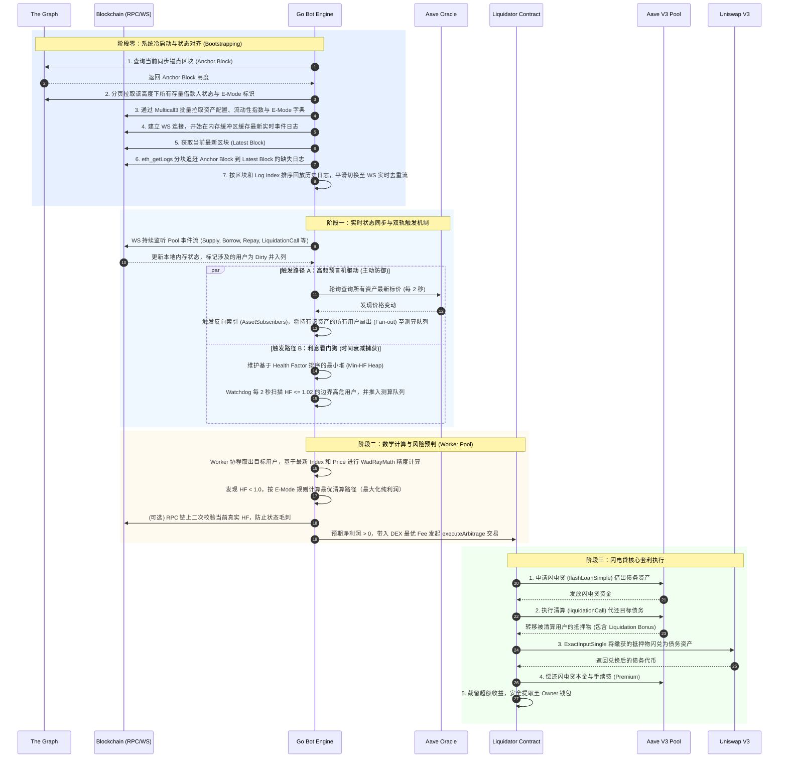

# Aave V3 清算套利机器人

一个专注于以太坊 Layer 2（如 Base、Arbitrum 等）的高性能 Aave V3 闪电贷清算机器人。本项目基于 Go 语言构建了极低延迟的链下状态机与风险测算引擎。通过实时监听链上事件、定时轮询预言机价格以及维护最小健康因子堆（Min-HF Heap），系统能够在水下仓位（Health Factor < 1.0）出现的毫秒级窗口内捕获机会，并自动通过智能合约发起闪电贷（Flash Loan）进行原子化的无本清算套利。

## 🏗 架构设计与执行时序

系统包含核心的三阶段链路：**状态同步与双轨触发** -> **风险预判** -> **闪电贷套利执行**。


## ✨ 核心特性

* **严密的无缝冷启动与日志追赶机制**
利用 The Graph API 极速拉取全局用户底仓（作为 Anchor Block 快照），并通过 Multicall3 高效补齐资产参数与 E-Mode 字典。在系统启动期间，建立 WebSocket 缓冲池收集最新日志，同时通过 `eth_getLogs` 分块拉取快照与当前区块间的“盲区日志”。通过排序回放与精确的 Log Index 去重，确保链下状态机与链上状态达成完美的一致性，且启动过程不会丢失任何一次清算机会。
* **双轨触发机制与高并发引擎**
	* **触发轨道一：预言机扇出**
独立协程定时（2s）轮询 Aave Oracle 的 `getAssetsPrices`。系统在本地维护了 `Asset -> Users` 的反向订阅关系。一旦发现某项资产价格发生变动，引擎会立刻触发扇出操作，将所有持有或借入该资产的用户无差别推入风险测算队列。
	* **触发轨道二：利息看门狗**
不仅依赖事件和价格驱动，系统创新性地在本地维护了一个以 Health Factor 为权重的**最小堆 (Min-HF Heap)**。独立的 Watchdog 协程会高频扫描堆顶数据，精准锁定 HF 逼近 1.0（如 <= 1.02）的边界用户，强制重新计算其状态。这使得机器人能有效捕获因时间推移、借款利息隐性累积而导致的跌破清算线的隐蔽机会。
	* **高并发 Worker Pool 与 E-Mode 延迟加载**
测算任务进入 `taskQueue` 后，由一组并发的 Worker 协程池消费。使用读写锁（`RWMutex`）保障内存安全。对于非紧急状态下的用户，采用延迟加载策略（仅当计算出 HF 低于安全阈值时，才通过 RPC 请求加载其具体的 E-Mode 配置），极大程度避免了冗余的 RPC 调用，确保系统在高并发下的网络 I/O 性能。


* **无本套利：深度整合 Aave 闪电贷**
清算合约 (`BaseAaveV3Liquidator.sol`) 原生集成了 `FlashLoanSimpleReceiverBase`。机器人在发现清算机会后无需垫付任何自有资金，通过单笔交易完成“借入债务资产 -> 替用户还款 -> 获得折扣抵押物 -> Uniswap V3 闪兑 -> 偿还闪电贷 -> 提取纯利润”的完整闭环，实现零资本风险套利。系统在测算阶段会自动剔除无利可图（滑点与闪电贷费损耗大于清算奖励）的伪机会，并施加自动冷却机制。
* **原生集成 Multicall3 批量 RPC 查询**
深度优化 RPC 节点交互频率。无论是冷启动时的资产数据加载，还是发送清算交易前针对用户最新仓位（`getUserAccountData`、`getUserConfiguration` 及 E-Mode 状态）的链上精准验证，均利用 Multicall3 打包为单次请求，大幅降低网络延迟与 RPC 节点调用成本，杜绝高并发下的 429 请求限制。
* **精确复刻 Aave V3 WadRayMath 精度**
抛弃容易引发精度丢失的浮点运算，`pkg/math` 模块实现了等价于 Solidity 底层的 `RayDiv` 与 `RayMul` 算法。在本地内存中对 `LiquidityIndex` 与 `VariableBorrowIndex` 进行 27 位 (RAY) 级别的运算，确保链下计算的余额与链上智能合约状态绝对一致。支持复杂的 E-Mode 规则（通过按位提取解析 `CollateralBitmap`）重写抵押物清算阈值与奖励系数。

## 🚀 快速开始

### 1. 环境准备与配置

克隆项目后，首先配置环境变量文件。项目中已提供基础模板：

```bash
cp .env_base_example .env_base

```

编辑 `.env_base` 文件，填入你的专属配置：

* `BOT_PRIVATE_KEY`: 负责发起交易的钱包私钥。
* `LIQUIDATOR_CONTRACT`: 部署在链上的 `BaseAaveV3Liquidator.sol` 合约地址。
* `RPC_URLS` / `WS_URL`: RPC 节点地址。
* `GRAPH_API_KEY`: The Graph 的查询密钥，用于系统冷启动时加载全局历史快照。

### 2. 编译与运行

确保已安装 Go 1.25.0 及以上版本。可以通过标准的 Go 命令直接运行或构建项目：

**拉取依赖并运行：**

```bash
go mod tidy
go run cmd/bot/main.go -env .env_base

```

**编译为可执行文件：**

```bash
go build -o aave_bot cmd/bot/main.go
./aave_bot -env .env_base

```
